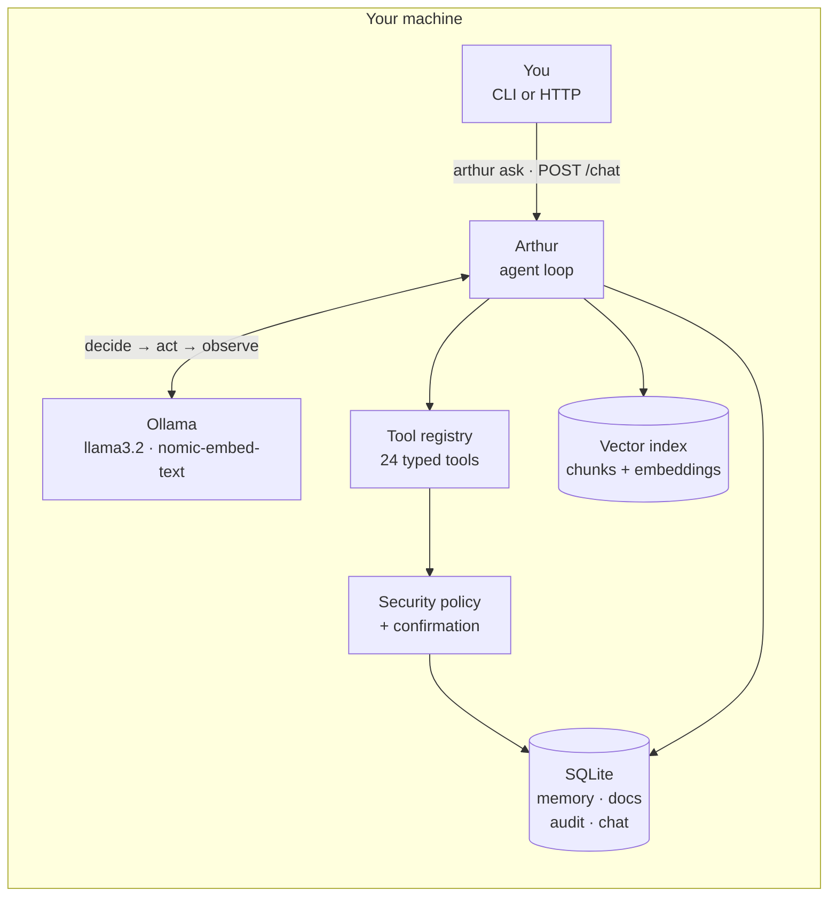
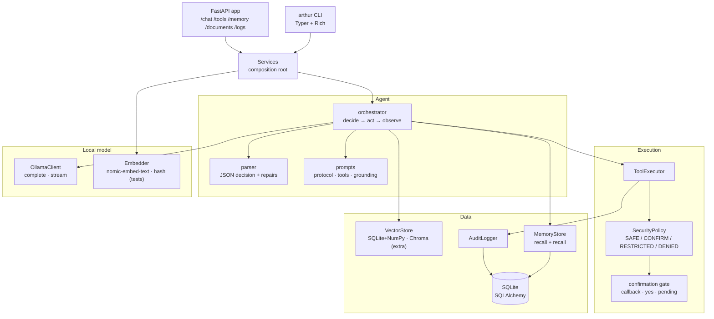
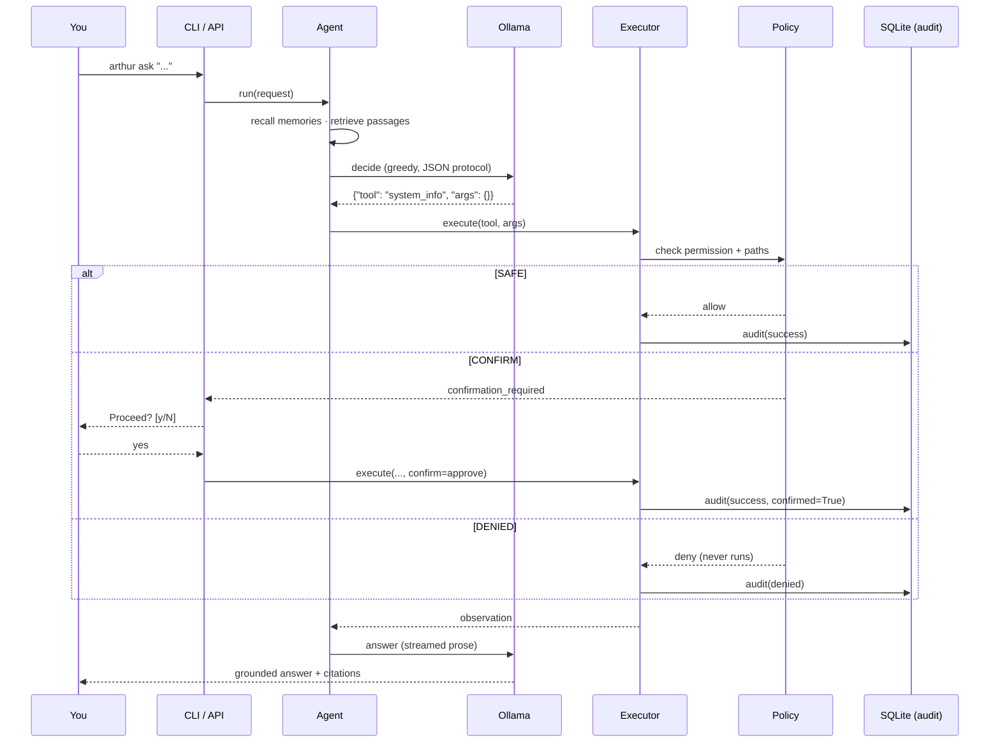

# Arthur

**A local-first AI engineering assistant for Linux.** Arthur runs entirely on your
machine: an [Ollama](https://ollama.com) model picks from a registry of 24 typed
tools, every action passes a security policy and a human confirmation gate, and
every execution lands in an append-only audit trail. No cloud API, no telemetry,
no mystery meat.



Nothing leaves the box: the only network socket Arthur opens is to `localhost`
and your local Ollama server.

---

## Why it exists

Most "AI coding assistants" ship your source tree to a vendor. Arthur is built
around the opposite constraint — **the model is untrusted input**:

* it picks tools, it never emits shell text;
* its arguments are validated against a path policy *before* execution;
* destructive operations cannot be approved by the model, only by you;
* citations are stripped unless they match a passage that was actually retrieved.

See [`docs/security.md`](docs/security.md) for the full threat model.

---

## Architecture



Both interfaces are thin shells over the same `Services` object, so the CLI and
the API cannot drift apart. Deeper detail lives in
[`docs/architecture.md`](docs/architecture.md).

### Request lifecycle



---

## Quick start

### 1. Prerequisites

* Linux, Python **3.12+**, [`uv`](https://docs.astral.sh/uv/)
* [Ollama](https://ollama.com) running locally, with two models pulled:

```bash
ollama serve &
ollama pull llama3.2:1b      # default chat model (configurable)
ollama pull nomic-embed-text  # default embedding model
```

### 2. Install

```bash
git clone <your-fork> arthur && cd arthur
uv sync                       # adds the `arthur` console script
uv run arthur doctor          # verifies Ollama, model, tools, DB
```

```
            Arthur doctor
┏━━━━━━━━━━━━┳━━━━━━━━┳━━━━━━━━━━━━━━━┓
┃ check      ┃ status ┃ detail        ┃
┡━━━━━━━━━━━━╇━━━━━━━━╇━━━━━━━━━━━━━━━┩
│ ollama     │ ok     │ ollama 0.18.3 │
│ model      │ ok     │ llama3.2:1b   │
│ tools      │ ok     │ 24 registered │
│ memory     │ ok     │ 4 entries     │
│ documents  │ ok     │ 1 indexed     │
│ audit      │ ok     │ 22 records    │
└────────────┴────────┴───────────────┘
```

### 3. Use it

```bash
# One-shot
uv run arthur ask "Show me my system information."

# Interactive REPL (Ctrl-D to quit)
uv run arthur chat

# Index your notes, then ask about them with citations
uv run arthur documents index ~/notes
uv run arthur ask "When does the warehouse sync run? Cite the document."
```

```
  1. system_info -> success SAFE · 2 ms
     The user wants host details; system_info provides them.

Your system information is as follows:

* Operating System: Arch Linux
* Hostname:        KITE
* Kernel:          7.2.7-zen1-1-zen
* Architecture:    x86_64
* CPUs:            8 logical / 4 physical
```

```bash
# HTTP API (loopback only; token optional)
uv run arthur serve
curl -s localhost:8420/health
curl -s localhost:8420/documents/search?q=warehouse%20sync
```

---

## Commands

| Command | What it does |
| --- | --- |
| `arthur` / `arthur chat` | Interactive chat REPL with live step trace |
| `arthur ask "..."` | One-shot request (`--yes` auto-confirms, `--quiet` hides the trace) |
| `arthur system info\|cpu\|mem\|disk\|ps\|net\|uptime` | Read-only system snapshots |
| `arthur memory add\|search\|list\|delete` | Long-term memory |
| `arthur documents index\|search` | RAG ingestion and semantic search |
| `arthur tools list\|show <name>` | Inspect the registry and a tool's schema |
| `arthur logs [--limit N]` | The audit trail |
| `arthur config-show` | Effective config with secrets redacted |
| `arthur doctor` | Environment health check |
| `arthur serve [--port N]` | Start the HTTP API |

### HTTP API

| Method | Path | Purpose |
| --- | --- | --- |
| `GET` | `/health` | Liveness + model/tool/index status |
| `POST` | `/chat` | Run the agent (`{"message": "...", "confirm": true}` to approve) |
| `GET` | `/tools` | Registry introspection |
| `POST` | `/tools/{name}/execute` | Call one tool directly (returns `confirmation_required` when gated) |
| `GET`/`POST`/`DELETE` | `/memory[/{id}]` | Memory CRUD |
| `POST` | `/documents/index` · `GET` `/documents/search` | RAG |
| `GET` | `/logs` | Audit query |

Set `ARTHUR_API_TOKEN` to require `Authorization: Bearer <token>` on everything
except `/health`.

---

## Tools

24 registered tools, grouped by permission level:

| Level | Meaning | Tools |
| --- | --- | --- |
| **SAFE** | Read-only or non-destructive; runs without asking | `system_info` `cpu_info` `memory_info` `disk_usage` `network_info` `process_list` `uptime` `read_file` `list_files` `search_files` `git_status` `git_log` `git_branches` `git_diff` `git_info` `search_documents` `index_documents` `recall` `remember` `write_file` `copy_file` |
| **CONFIRM** | Asks you first | `delete_file` `move_file` `run_command` |
| **RESTRICTED** | Denied unless `allow_restricted=true` | *(per-config overrides)* |
| **DENIED** | Never runs | anything failing the path/command policy |

Some tools raise their level for a specific call: `write_file` and `copy_file`
are `SAFE` when creating a file but upgrade to `CONFIRM` when they would
overwrite an existing one.

`run_command` is additionally gated behind `security.default_shell_access`
(**off by default**) and only accepts allow-listed binaries invoked as an argv
array — `shell=True` is never used anywhere in the codebase, and mutating verbs
(`rm`, `reboot`, `shutdown`, …) are refused even inside the allow-list.

---

## Configuration

Precedence: **environment → `~/.config/arthur/config.toml` → defaults**.
Point at another file with `--config path` or `ARTHUR_CONFIG`.

```toml
# ~/.config/arthur/config.toml
[llm]
host = "http://localhost:11434"
model = "llama3.2:1b"          # any model Ollama serves
embedding_model = "nomic-embed-text"
num_ctx = 8192                 # prompt window
timeout_seconds = 180

[agent]
max_steps = 6                  # decide → act budget
auto_retrieve = true           # ground answers in indexed passages
auto_retrieve_min_score = 0.6  # skip irrelevant passages

[security]
default_shell_access = false   # keep false unless you mean it
require_confirmation = true
allowed_roots = ["/home/you/projects"]

[retrieval]
backend = "sqlite"             # or "chroma" (uv sync --extra chroma)
embedder = "ollama"            # or "hash" (offline/tests)
```

Every field also takes an environment variable: `ARTHUR_<SECTION>_<FIELD>`, e.g.
`ARTHUR_LLM_MODEL=llama3.2:3b`, `ARTHUR_SECURITY_ALLOWED_ROOTS=/srv/app`.
`OLLAMA_HOST` and `MODEL_NAME` are supported as familiar aliases.
See [`.env.example`](.env.example).

---

## Development

```bash
uv sync --all-extras          # optional: chroma + pdf extras
uv run pytest                 # 241 tests
uv run ruff check .           # lint
uv run ruff format --check .  # formatting
uv run mypy src               # strict typing
```

Tests are grouped by intent:

* `tests/unit` — pure logic (parser, policy, chunking, prompts, stores)
* `tests/integration` — the real Services graph with only the LLM scripted,
  plus a real temp git repo and the FastAPI/Typer surfaces
* `tests/security` — denials, path escapes, confirmation and audit assertions

No fake benchmarks, no mocked-away security checks: the security suite asserts
that a hostile tool *never executes*, not that it returns an error.

More in [`docs/development.md`](docs/development.md).

---

## Project layout

```
src/arthur/
├── agent/        # orchestrator, JSON decision parser, agent types
├── api/          # FastAPI shell + response schemas
├── cli/          # Typer commands and the chat REPL
├── config/       # Pydantic config, TOML loader, env overrides
├── database/     # SQLAlchemy models, repositories, session helpers
├── execution/    # ToolExecutor: validate → permission → confirm → audit
├── llm/          # Ollama client, prompts, scripted test double
├── logging/      # structured logging + audit sink
├── memory/       # long-term memory store and recall
├── retrieval/    # chunking, embeddings, vector store, citations
├── security/     # permission levels, path policy, command policy, confirmation
├── tools/        # the 24 registered tools + registry
└── services.py   # composition root shared by CLI and API
```

---

## Documentation

| Document | Contents |
| --- | --- |
| [`docs/architecture.md`](docs/architecture.md) | Layers, data flow, extension points |
| [`docs/security.md`](docs/security.md) | Threat model, permission levels, path/command policy |
| [`docs/development.md`](docs/development.md) | Setup, quality gates, testing conventions, release |

---

## License

MIT — see [`LICENSE`](LICENSE).
