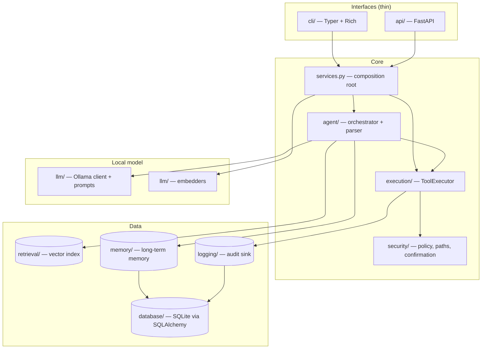
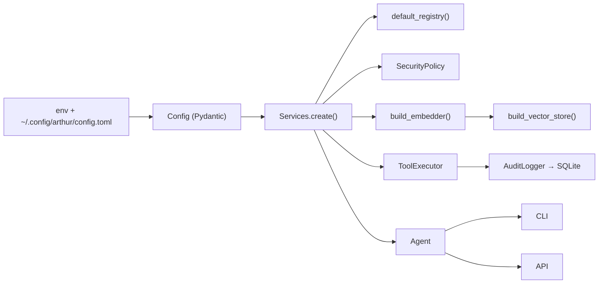
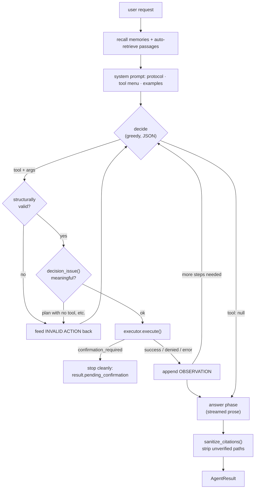
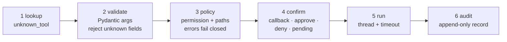
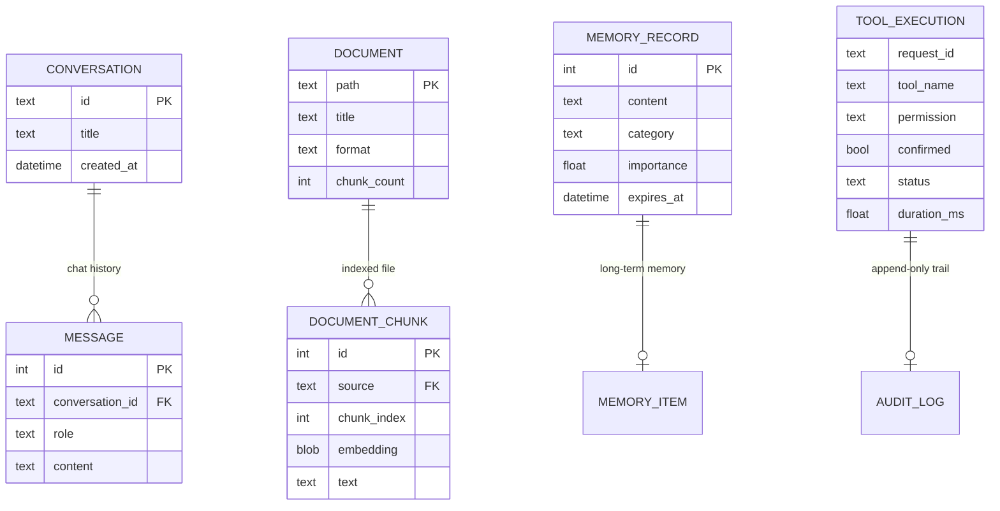
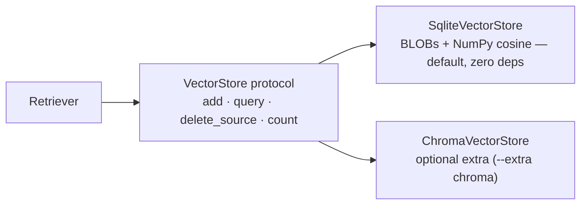
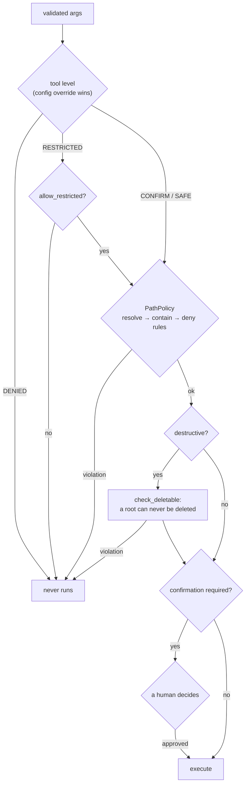

# Architecture

Arthur is a single Python package with four hard boundaries: **interfaces** (CLI,
API), an **agent** that turns natural language into typed tool calls, an
**execution** layer that decides whether a call is allowed, and **data** stores
(SQLite for structured state, a vector index for retrieval).



**Rule of thumb:** `cli/` and `api/` contain no business logic. They format
input, call `Services`, and render the result. If a behaviour exists in both
interfaces, it belongs one layer down.

---

## Composition root

`src/arthur/services.py` is the only place that constructs objects. `Services.create()`
loads configuration, opens the database, builds the embedder and vector store,
registers tools, and wires the executor's audit sink — in that order. Both
`arthur` (CLI) and `create_app()` (API) call it, so a tool behaves identically
regardless of which surface invoked it.



Tests build a real `Services` graph with an in-memory database and a scripted
LLM, which is why integration tests exercise the actual policy and audit trail
rather than mocks.

---

## The agent loop

Arthur uses a **model-agnostic JSON decision protocol** instead of provider
tool-calling APIs. Any instruct model served by Ollama works, and every
decision is parseable, testable and auditable.



### Why decisions are a separate phase

1. **Portability** — no dependency on OpenAI-style tool schemas.
2. **Repairability** — a malformed reply is fed back as a bounded correction
   (`max_repairs`, default 2) instead of crashing the run.
3. **Streaming** — only the final answer streams to the user; the JSON
   scaffolding never reaches the terminal.

### Reliability measures

| Problem | Countermeasure |
| --- | --- |
| Model wraps JSON in prose or fences | `_extract_json_object` finds the first balanced object |
| Truncated JSON (small `num_ctx`) | `num_ctx=8192`, compact tool menu, greedy decisions |
| Structurally valid but meaningless output (`plan` with no tool) | `decision_issue()` routes it through the same repair path |
| Repeated failures | bounded by `max_repairs`, then degrade to `parse_failure` with a best-effort answer |
| Model skips retrieval and invents facts | `agent.auto_retrieve` injects passages before the first decision |
| Model echoes its own JSON in the answer | decision transcripts are dropped from the answer context |
| Invented document paths | `sanitize_citations()` removes anything not actually retrieved |

### Bounded work

`max_steps` (default 6) caps the decide→act cycle. Hitting it appends an
explicit "best final answer now" instruction rather than looping forever. Every
tool additionally runs under a per-tool `timeout` enforced with a worker thread.

---

## Execution pipeline

`ToolExecutor.execute()` runs six ordered stages. Each returns a structured
`ExecutionOutcome` — **the executor never raises for policy outcomes** — and
every invocation, including denials, writes an `ExecutionRecord`.



Statuses: `success`, `error`, `denied`, `declined`, `confirmation_required`,
`invalid_args`, `timeout`, `unknown_tool`.

### Confirmation semantics

`confirm` accepts four shapes, which is what lets one executor serve an
interactive CLI, a one-shot `--yes`, and a stateless HTTP request:

| Value | Meaning | Outcome |
| --- | --- | --- |
| callable | Ask the human (CLI prompt) | proceeds or `declined` |
| `True` | Approved (`--yes`, API `confirm: true`) | runs, audited `confirmed=True` |
| `False` | Declined | `declined` without prompting |
| `None` | Nobody to ask | `confirmation_required` + `request`; agent stops cleanly and the API re-posts with `confirm: true` |

---

## Data model



Chat history, documents, memory and audit records share one SQLite file
(`~/.local/share/arthur/arthur.db`). Conversation replay and memory recall are
plain SQL; only document retrieval goes through the vector store.

### Vector store abstraction



The backend is a config switch (`retrieval.backend`), so swapping in Chroma or
FAISS is a local change: implement `add`, `query`, `delete_source`, `count`.

Embeddings follow the same pattern — `OllamaEmbedder` (`nomic-embed-text`) by
default, `HashEmbedder` (blake2b) for offline runs and tests, selected by
`retrieval.embedder`.

---

## Security layer

The policy sits *between* argument validation and execution, so no tool can run
without being classified. Details in [`security.md`](security.md).



---

## Extension points

| To add… | Do this |
| --- | --- |
| A tool | Subclass `Tool[ArgsModel]` in `src/arthur/tools/`, set the `ClassVar`s (`name`, `permission`, `action`, `risk`, `args_model`), implement `run()`, register it in `default_registry()` |
| An LLM backend | Implement `LLMClient` (`complete`, `stream`, `health`) and construct it in `Services` — the agent only sees the protocol |
| A vector backend | Implement the `VectorStore` protocol and add it to `build_vector_store()` |
| An embedding backend | Implement `Embedder` and add it to `build_embedder()` |
| A config field | Add it to the relevant Pydantic section in `config/schema.py`; `ARTHUR_<SECTION>_<FIELD>` env support follows automatically |
| An API endpoint | Add a thin handler in `api/app.py` that calls `Services` |

Adding a tool is the common case, so the contract is deliberately minimal:

```python
class ReadFileTool(Tool[ReadFileArgs]):
    name = "read_file"
    description = "Read a text file (with line numbers)."
    action = "Read a file"
    permission = PermissionLevel.SAFE
    args_model = ReadFileArgs

    def run(self, args: ReadFileArgs, ctx: ToolContext) -> ToolResult:
        text = ctx.paths.resolve(args.path).read_text(encoding="utf-8")
        return ToolResult(summary=f"{len(text)} bytes", data={"text": text})
```

`permission` is the only line that decides whether a human is asked; the path
policy applies automatically because `ToolExecutor` routes every path argument
through it.

---

## Module map

| Package | Responsibility | Key module |
| --- | --- | --- |
| `agent/` | The loop and the decision protocol | `orchestrator.py`, `parser.py` |
| `execution/` | Validate → permission → confirm → run → audit | `executor.py`, `types.py` |
| `security/` | Permission levels, path/command policy, confirmation | `policy.py`, `paths.py` |
| `tools/` | 24 registered tools and the registry | `base.py`, `registry.py` |
| `retrieval/` | Chunking, embeddings, vector store, citations | `service.py`, `store.py` |
| `memory/` | Long-term memory and keyword recall | `store.py` |
| `llm/` | Ollama client, prompts, test double | `ollama.py`, `prompts.py` |
| `database/` | Models, repositories, sessions | `models.py`, `repos.py` |
| `config/` | Pydantic schema, TOML loader, env overrides | `schema.py`, `loader.py` |
| `logging/` | Structured logging and the audit sink | `setup.py`, `audit.py` |
| `cli/`, `api/` | Interfaces over `Services` | `chat.py`, `app.py` |
