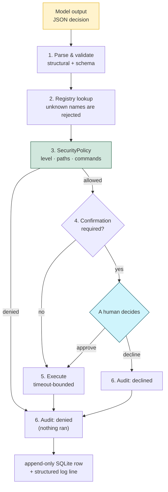
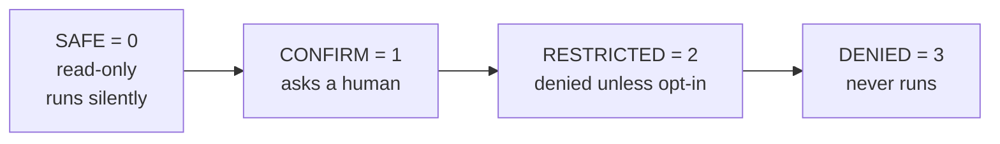
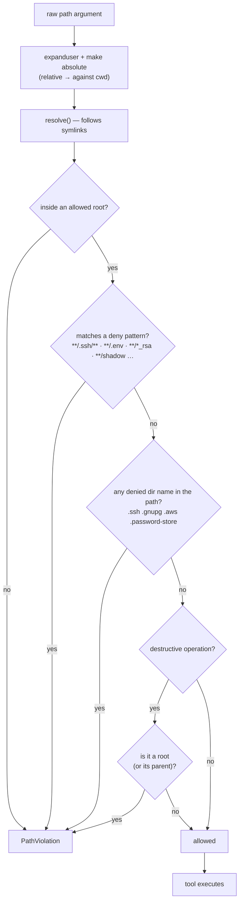
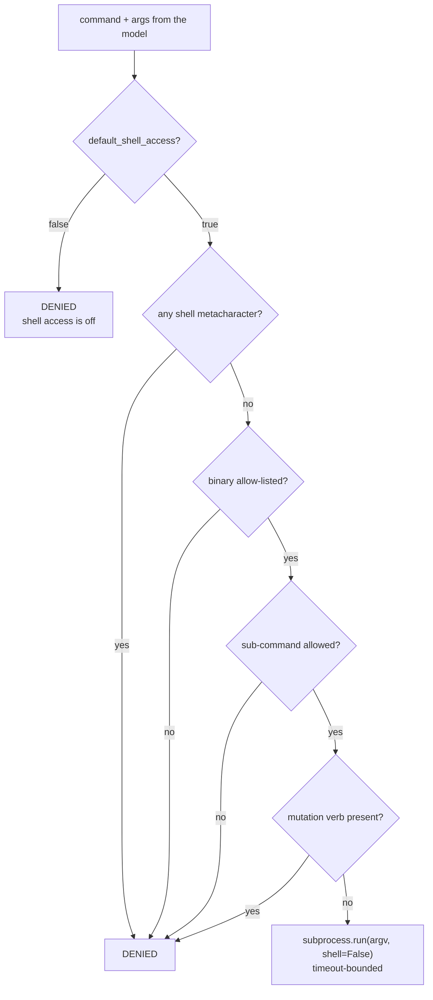
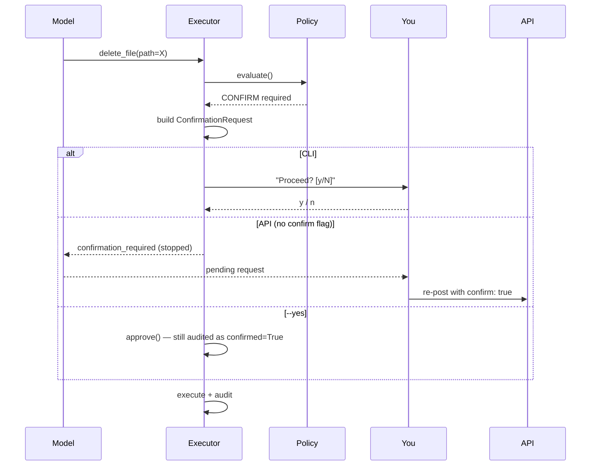

# Security

Arthur treats the model as **untrusted input**. The language model's only power
is choosing a registered tool and filling in arguments; everything else —
whether the call is allowed, whether a human must approve it, which paths are
reachable, and what gets recorded — is decided by code that the model cannot
influence.



**The model appears exactly once in this diagram, at the top.**

---

## Threat model

| # | Threat | Countermeasure |
| --- | --- | --- |
| 1 | Model invents a tool that doesn't exist | Registry lookup fails closed → `unknown_tool`, audited |
| 2 | Model passes wrong/malicious arguments | Pydantic validates the schema; **unexpected fields are rejected**, not ignored |
| 3 | Model reaches outside the workspace | `PathPolicy.resolve()` before any filesystem call |
| 4 | Symlink inside the sandbox points outside | Paths are `resolve()`d **before** the containment check |
| 5 | Model reads SSH keys, `.env`, cloud credentials | Deny-listed patterns and directory names, checked anywhere in the path |
| 6 | Model deletes an allowed root (`/` or the workspace) | `check_deletable()` runs for destructive tools **before** any confirmation prompt |
| 7 | Model runs arbitrary shell | `shell=True` is never used; `run_command` is off by default and allow-listed |
| 8 | Model sneaks a mutating verb past the allow-list | `DENIED_COMMAND_TOKENS` refuses `rm`, `reboot`, `kill`, `chmod`, … |
| 9 | Model approves its own destructive action | Confirmation callbacks are supplied by the interface, never by the model |
| 10 | Fabricated document citations | `sanitize_citations()` strips anything not actually retrieved |
| 11 | Prompt injection ("ignore your rules") | Instructions can't change permissions; policy runs after the model |
| 12 | Silent or unattributed actions | Every invocation — including denials — writes an audit row |
| 13 | API exposed beyond loopback | Binds `127.0.0.1` by default; bearer token when `ARTHUR_API_TOKEN` is set |
| 14 | Secrets leaking into logs or config dumps | `config-show` redacts tokens; log payloads carry the audit record only |

**Out of scope:** a compromised host, a malicious Ollama server, other local
users reading `~/.local/share/arthur/`, and physical access.

---

## Permission levels

`PermissionLevel` is an ordered `IntEnum` — higher means more restrictive:



| Level | Behaviour | Examples |
| --- | --- | --- |
| `SAFE` | Executes without prompting | `system_info`, `read_file`, `git_status`, `search_documents` |
| `CONFIRM` | Requires human approval before running | `delete_file`, `move_file`, `run_command` |
| `RESTRICTED` | Denied unless `security.allow_restricted = true` | per-config overrides |
| `DENIED` | Refused before any prompt or filesystem access | anything failing policy |

A tool may also declare a higher level *for a specific call*: `write_file` is
`SAFE` when creating a file, but `permission_for()` returns `CONFIRM` when the
target already exists — overwriting is what needs a human, not writing.

The level comes from the tool's class attribute, and configuration can replace
it per tool — typically to **tighten** a tool, though lowering is technically
possible and therefore visible in the config dump:

```toml
[security]
tool_overrides = { read_file = "CONFIRM", delete_file = "DENIED" }
```

Overrides are parsed with `PermissionLevel.parse()` and validated when the
config loads, so a typo (`"RESTRICTEDD"`) fails at startup rather than silently
downgrading protection mid-run. Tools can also raise their own level for a
specific call — `write_file` upgrades `SAFE` → `CONFIRM` when the target
already exists.

---

## Path policy

Every path argument in `PATH_ARG_KEYS` (`path`, `file_path`, `source`,
`target`, `destination`, `root`, `directory`, `dir`) goes through `PathPolicy`
**before** the tool runs.



Defaults are intentionally conservative:

* **Allowed roots** — your home directory (`security.allowed_roots` to narrow
  or widen it). Note this applies to *Arthur*, not to you.
* **Denied patterns** — `**/.ssh/**`, `**/.gnupg/**`, `**/.aws/**`,
  `**/.env*`, `**/*_rsa`, `**/*_ed25519`, `**/shadow`, `**/.git-credentials`,
  `**/.docker/config.json`, …
* **Denied directory names** — `.ssh`, `.gnupg`, `.aws`, `.password-store`,
  rejected anywhere in the path.
* **Deletion** — `check_deletable()` refuses to delete a configured root, so
  even an approved `delete_file` can't remove the workspace.

Resolving before containment is what makes symlink escapes fail: a link at
`~/project/escape -> /etc` resolves to `/etc`, which is outside the root, and
is rejected.

---

## Command execution

`run_command` is Arthur's most dangerous tool and is therefore **disabled by
default**:

```toml
[security]
default_shell_access = false   # default
```

When it *is* enabled, four independent layers still apply:

1. **No shell.** `run_argv` uses `subprocess.run(argv, shell=False)` with an
   argv list. There is no string interpolation, so metacharacters
   (`;`, `|`, `&`, `` ` ``, `$`, `<`, `>`, newlines, globs, `~`) in any
   argument are rejected outright.
2. **Binary allow-list.** Only `DEFAULT_ALLOWED_COMMANDS` binaries may run —
   `date df du free hostname id ip lscpu lsblk nproc ps ss systemctl uname
   uptime whoami`. Everything else is `DENIED`.
3. **Sub-command allow-list.** Where a verb is required (`systemctl status`),
   the allowed verbs are enumerated; `systemctl reboot` is not among them.
4. **Mutation-verb guard.** `DENIED_COMMAND_TOKENS` refuses state-changing
   positionals (`rm`, `reboot`, `shutdown`, `kill`, `chmod`, `mount`, `wipe`,
   `mkfs`, `stop`, `disable`, …) *regardless* of the allow-list.



Denials are reported as a structured reason and audited like any other call.

---

## Confirmation

The model cannot approve anything. Approval comes from the *interface*:



| Caller | `confirm` value | Result |
| --- | --- | --- |
| Interactive CLI | callback | prompts you |
| `arthur ask --yes` | `True` | approves, `confirmed=True` in the audit |
| API without flag | `None` | returns `confirmation_required`; agent stops cleanly |
| API with `{"confirm": true}` | `True` | runs |
| Policy default | `False` | declines (safe when no UI is attached) |

`ConfirmationRequest.describe()` renders the CLI panel shown to you — tool
action, target, reason and risk — so approval is never a blind `y`.

---

## Audit trail

Every `ToolExecutor.execute()` call produces one `ExecutionRecord`, written
both to a structured log line and to the `tool_executions` table:

| Column | Meaning |
| --- | --- |
| `request_id` | Correlates all calls spawned by one user request |
| `request` | The user request that motivated the call (truncated to 500 chars) |
| `tool_name`, `arguments` | What was called, with which arguments |
| `permission` | The permission level that applied |
| `confirmed` | Whether a human approved it |
| `status` | `success` / `denied` / `declined` / `confirmation_required` / `invalid_args` / `timeout` / `unknown_tool` / `error` |
| `duration_ms`, `created_at` | Timing |

```bash
arthur logs --limit 20          # CLI table
curl -s localhost:8420/logs     # HTTP
```

Audit writes are best-effort by design: a database failure is logged and
swallowed so that auditing can never break the operation it is observing, and
the log file remains a second trail.

---

## API surface

* Binds `127.0.0.1:8420` by default — it is not a public service.
* With `ARTHUR_API_TOKEN` set, every endpoint except `GET /health` requires
  `Authorization: Bearer <token>`; missing/wrong tokens get `401`.
* Without a token the server says so at startup.
* `POST /tools/{name}/execute` passes through the same executor, so it can
  return `confirmation_required` instead of executing.
* Response models are explicit Pydantic schemas — internal types aren't leaked.

---

## Reporting

Arthur is a local tool with no network attack surface beyond loopback, but if
you find a path escape, a confirmation bypass, or a way for the model to reach
an unregistered operation, please open an issue with a reproduction and the
relevant `arthur logs` output.
